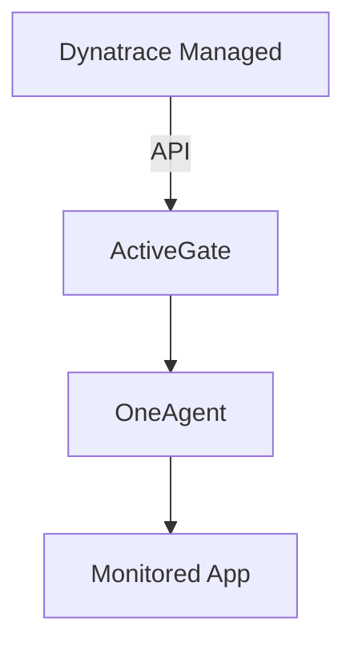

# Technical Architecture Document
## Deep Dive Presents (D1-ESA) Application

**Version:** 1.0
**Date:** 2025-11-09
**Status:** Design

---

## Table of Contents

1. [Architecture Overview](#architecture-overview)
2. [Technology Stack](#technology-stack)
3. [Component Architecture](#component-architecture)
4. [Data Architecture](#data-architecture)
5. [Navigation System](#navigation-system)
6. [State Management](#state-management)
7. [Content Management](#content-management)
8. [Performance Considerations](#performance-considerations)
9. [Security Architecture](#security-architecture)
10. [Deployment Architecture](#deployment-architecture)
11. [Integration Points](#integration-points)
12. [Scalability & Future Extensions](#scalability--future-extensions)

---

## Architecture Overview

### High-Level Architecture

```
┌─────────────────────────────────────────────────────────────────┐
│                     Dynatrace ESA Platform                      │
│                  (Gen3 Application Environment)                 │
└─────────────────────────────────────────────────────────────────┘
                              │
                              ▼
┌─────────────────────────────────────────────────────────────────┐
│                    Deep Dive Presents App                       │
│  ┌───────────────────────────────────────────────────────────┐  │
│  │              Top Navigation (Chevron Bar)                 │  │
│  │  [Arch] [Challenges] [AI] [Demo] [Splunk] [Vision] [Q&A] │  │
│  └───────────────────────────────────────────────────────────┘  │
│  ┌─────────────┬───────────────────────────────────────────────┐│
│  │  Sidebar    │         Content Display Area                 ││
│  │  Navigation │  ┌─────────────────────────────────────────┐ ││
│  │             │  │  Rich Content Renderer                  │ ││
│  │  • Topic 1  │  │  • Markdown                             │ ││
│  │  • Topic 2  │  │  • Code Blocks                          │ ││
│  │  • Topic 3  │  │  • Diagrams                             │ ││
│  │    ○ Sub 1  │  │  • Case Studies                         │ ││
│  │    ○ Sub 2  │  │  • Interactive Components               │ ││
│  │  • Topic 4  │  │                                         │ ││
│  │             │  └─────────────────────────────────────────┘ ││
│  │             │                                                ││
│  │  [Search]   │  Progress: ████████░░ 80%                     ││
│  │  [Bookmark] │                                                ││
│  └─────────────┴────────────────────────────────────────────────┘│
└─────────────────────────────────────────────────────────────────┘
                              │
                              ▼
┌─────────────────────────────────────────────────────────────────┐
│                         Data Layer                              │
│  ┌──────────────┐  ┌──────────────┐  ┌──────────────┐          │
│  │   Content    │  │    User      │  │   Session    │          │
│  │   Storage    │  │  Progress    │  │    State     │          │
│  │  (Markdown)  │  │ (LocalStore) │  │  (Context)   │          │
│  └──────────────┘  └──────────────┘  └──────────────┘          │
└─────────────────────────────────────────────────────────────────┘
```

### Design Principles

1. **Progressive Disclosure**: Information revealed as needed, preventing overwhelm
2. **Component Modularity**: Self-contained, reusable components
3. **Responsive Design**: Adapt to various screen sizes and devices
4. **Performance First**: Lazy loading, code splitting, optimized rendering
5. **Accessibility**: WCAG 2.1 AA compliance
6. **Type Safety**: Comprehensive TypeScript coverage

---

## Technology Stack

### Frontend Framework
```typescript
{
  "framework": "React 18.3.1",
  "language": "TypeScript 5.4.0",
  "uiLibrary": "Dynatrace Strato Components",
  "styling": "Dynatrace Design Tokens + CSS-in-JS",
  "stateManagement": "React Context API",
  "routing": "Custom navigation system"
}
```

### Core Dependencies

| Package | Version | Purpose |
|---------|---------|---------|
| `react` | 18.3.1 | Core UI framework |
| `react-dom` | 18.3.1 | DOM rendering |
| `typescript` | 5.4.0 | Type safety |
| `@dynatrace/strato-components` | 1.0.0 | UI component library |
| `@dynatrace/strato-components-preview` | 2.4.1 | Preview components (DataTable, DQLEditor) |
| `@dynatrace/strato-design-tokens` | 1.0.0 | Design system tokens |
| `@dynatrace/strato-icons` | 1.0.0 | Icon library |
| `@dynatrace-sdk/app-environment` | 1.0.0 | Dynatrace app utilities |
| `@dynatrace-sdk/navigation` | 2.1.1 | Navigation helpers |
| `react-intl` | 6.3.0 | Internationalization |

### Development Tools

- **Build Tool**: `dt-app` (Dynatrace ESA CLI)
- **Linting**: ESLint with TypeScript rules
- **Type Checking**: TypeScript compiler
- **Package Manager**: npm

---

## Component Architecture

### Component Hierarchy

```
App (Root)
│
├── DeepDivePresentation (Main Container)
│   │
│   ├── TopNavigationBar (Chevron Navigation)
│   │   ├── ChevronStep (x8 - one per module)
│   │   └── ProgressIndicator
│   │
│   ├── MainLayout
│   │   │
│   │   ├── LeftSidebar
│   │   │   ├── TopicList
│   │   │   │   ├── TopicItem (expandable)
│   │   │   │   └── SubTopicItem
│   │   │   ├── SearchBar
│   │   │   ├── BookmarkList
│   │   │   └── ProgressWidget
│   │   │
│   │   └── ContentArea
│   │       ├── ContentRenderer
│   │       │   ├── MarkdownRenderer
│   │       │   ├── CodeBlock
│   │       │   ├── DiagramViewer
│   │       │   ├── CaseStudyCard
│   │       │   └── InteractiveDemo
│   │       │
│   │       └── ContentActions
│   │           ├── BookmarkButton
│   │           ├── NoteEditor
│   │           └── ShareButton
│   │
│   └── SessionManager (Optional - Collaborative Mode)
│       ├── SessionControls
│       └── ParticipantList
```

### Core Components

#### 1. TopNavigationBar Component

**Purpose**: Primary navigation across 8 major modules

**Props**:
```typescript
interface TopNavigationBarProps {
  currentModule: ModuleId;
  onModuleChange: (module: ModuleId) => void;
  progress: Record<ModuleId, number>; // 0-100
  completedTopics: Set<string>;
}

type ModuleId =
  | 'architectures'
  | 'challenges'
  | 'ai-crash-course'
  | 'app-demo'
  | 'splunk-migration'
  | 'dynabridge-vision'
  | 'blueprint'
  | 'qa';
```

**Features**:
- Clickable chevron steps
- Visual progress indicator per module
- Active state highlighting
- Responsive collapse on mobile

#### 2. LeftSidebar Component

**Purpose**: Topic-level navigation within active module

**Props**:
```typescript
interface LeftSidebarProps {
  module: ModuleId;
  topics: Topic[];
  activeTopic: string;
  onTopicSelect: (topicId: string) => void;
  bookmarks: Set<string>;
  searchQuery: string;
  onSearchChange: (query: string) => void;
}

interface Topic {
  id: string;
  title: string;
  completed: boolean;
  duration: number; // estimated minutes
  subtopics?: Topic[];
  icon?: string;
}
```

**Features**:
- Hierarchical topic display
- Expand/collapse subtopics
- Search filtering
- Bookmark indicators
- Progress checkmarks
- Estimated time display

#### 3. ContentArea Component

**Purpose**: Display rich content for selected topic

**Props**:
```typescript
interface ContentAreaProps {
  topic: TopicContent;
  onBookmark: (topicId: string) => void;
  isBookmarked: boolean;
  userNotes: string;
  onNoteChange: (notes: string) => void;
}

interface TopicContent {
  id: string;
  title: string;
  type: 'markdown' | 'case-study' | 'diagram' | 'interactive';
  content: string;
  metadata: {
    duration: number;
    tags: string[];
    relatedTopics: string[];
  };
}
```

**Features**:
- Markdown rendering with syntax highlighting
- Lazy-loaded images and diagrams
- Interactive code examples
- Zoom and pan for diagrams
- Bookmark and note functionality

#### 4. ChevronStep Component

**Purpose**: Individual module indicator in chevron navigation

**Implementation**:
```typescript
interface ChevronStepProps {
  module: ModuleId;
  title: string;
  isActive: boolean;
  isCompleted: boolean;
  progress: number;
  onClick: () => void;
}
```

**Visual States**:
- Default (not started)
- Active (current)
- Completed (with checkmark)
- In Progress (partial fill)

---

## Data Architecture

### Content Storage Strategy

#### File Structure

```
/content
├── modules.json                      # Module definitions
├── architectures/
│   ├── index.json                    # Module metadata
│   ├── managed-offline.md
│   ├── managed-pha.md
│   ├── saas-classic.md
│   └── saas-gen3.md
├── challenges/
│   ├── index.json
│   ├── overview.md
│   ├── case-studies/
│   │   ├── accenture.md
│   │   ├── academy.md
│   │   ├── shell.md
│   │   ├── gm.md
│   │   ├── frit-boa.md
│   │   └── american-airlines.md
│   └── service-gaps/
│       ├── solution-architects.md
│       ├── services-consultants.md
│       └── account-teams.md
├── ai-crash-course/
│   ├── index.json
│   ├── ai-mindset.md
│   ├── security.md
│   ├── ollama-private-hosting.md
│   ├── rag-fundamentals.md
│   ├── claude-ecosystem.md
│   └── security-deployment.md
├── app-demo/
│   ├── index.json
│   ├── template-overview.md
│   └── volumetric-explorer.md
├── splunk-migration/
│   ├── index.json
│   ├── challenges.md
│   ├── conversion-complexity.md
│   ├── manual-process.md
│   └── dynabridge-splunk.md
├── dynabridge-vision/
│   ├── index.json
│   ├── platform-expansion.md
│   └── workflow-consistency.md
├── blueprint/
│   ├── index.json
│   ├── organization-vision.md
│   ├── forge-initiative.md
│   ├── langgraph.md
│   └── pulseboard.md
└── qa/
    └── index.json
```

#### Content Schema

**modules.json**:
```json
{
  "modules": [
    {
      "id": "architectures",
      "title": "Dynatrace Architectures & Challenges",
      "description": "Overview of Dynatrace deployment models",
      "duration": 20,
      "order": 1,
      "icon": "architecture",
      "color": "#6c5dd3"
    }
  ]
}
```

**index.json** (per module):
```json
{
  "module": "architectures",
  "topics": [
    {
      "id": "managed-offline",
      "title": "Dynatrace Managed Offline",
      "contentFile": "managed-offline.md",
      "duration": 5,
      "order": 1,
      "tags": ["architecture", "managed", "offline"],
      "relatedTopics": ["managed-pha", "saas-classic"]
    }
  ]
}
```

### User Data Storage

#### LocalStorage Schema

```typescript
interface UserProgress {
  userId: string;
  lastAccessed: string; // ISO timestamp
  currentModule: ModuleId;
  currentTopic: string;
  completedTopics: Set<string>;
  bookmarks: Set<string>;
  notes: Record<string, string>; // topicId -> note
  sessionTime: number; // total minutes
  moduleProgress: Record<ModuleId, number>; // 0-100
}

interface SessionState {
  sessionId?: string;
  isPresenterMode: boolean;
  participants?: string[];
  syncEnabled: boolean;
}
```

#### State Persistence

- **LocalStorage**: User progress, bookmarks, notes
- **SessionStorage**: Current navigation state
- **Context API**: Real-time application state
- **Optional Backend**: Collaborative sessions (future)

---

## Navigation System

### URL Structure (Internal Routing)

```
/#/modules/architectures
/#/modules/architectures/managed-offline
/#/modules/challenges/case-studies/accenture
/#/modules/ai-crash-course/claude-ecosystem
/#/bookmarks
/#/search?q=splunk
```

### Navigation State Machine

```typescript
interface NavigationState {
  currentModule: ModuleId;
  currentTopic: string | null;
  breadcrumb: BreadcrumbItem[];
  history: string[];
  canGoBack: boolean;
  canGoForward: boolean;
}

interface BreadcrumbItem {
  label: string;
  path: string;
}
```

### Navigation Handlers

```typescript
// Navigate to module
navigateToModule(moduleId: ModuleId): void

// Navigate to specific topic
navigateToTopic(moduleId: ModuleId, topicId: string): void

// Navigate to next/previous topic
navigateNext(): void
navigatePrevious(): void

// Navigate to bookmark
navigateToBookmark(topicId: string): void

// Handle browser back/forward
handleBrowserNavigation(): void
```

---

## State Management

### Context Structure

```typescript
// AppContext: Global application state
interface AppContextType {
  // Navigation
  navigation: NavigationState;
  setNavigation: (state: NavigationState) => void;

  // Content
  modules: Module[];
  currentContent: TopicContent | null;

  // User State
  progress: UserProgress;
  updateProgress: (updates: Partial<UserProgress>) => void;

  // UI State
  sidebarCollapsed: boolean;
  searchOpen: boolean;
  bookmarksOpen: boolean;

  // Session
  session: SessionState | null;
}

// ContentContext: Content-specific state
interface ContentContextType {
  content: Map<string, TopicContent>;
  loadContent: (topicId: string) => Promise<TopicContent>;
  cacheContent: (content: TopicContent) => void;
}

// SearchContext: Search functionality
interface SearchContextType {
  query: string;
  results: SearchResult[];
  isSearching: boolean;
  search: (query: string) => Promise<void>;
}
```

### State Flow Diagram

```
User Action
    │
    ▼
Component Event Handler
    │
    ▼
Context Update Function
    │
    ├─▶ Update Context State
    │
    ├─▶ Persist to LocalStorage
    │
    └─▶ Trigger Re-render
          │
          ▼
    Component Updates
```

---

## Content Management

### Content Loading Strategy

#### 1. Initial Load
- Load `modules.json` (module definitions)
- Load first module's `index.json`
- Load first topic's content
- Preload next topic in background

#### 2. Lazy Loading
```typescript
const loadTopicContent = async (topicId: string): Promise<TopicContent> => {
  // Check cache first
  if (contentCache.has(topicId)) {
    return contentCache.get(topicId);
  }

  // Load from file
  const response = await fetch(`/content/${topicId}.md`);
  const markdown = await response.text();

  const content = {
    id: topicId,
    type: 'markdown',
    content: markdown,
    metadata: await loadTopicMetadata(topicId)
  };

  // Cache for future use
  contentCache.set(topicId, content);

  return content;
};
```

#### 3. Preloading Strategy
- Preload adjacent topics (previous/next)
- Preload all topics in current module (low priority)
- Preload bookmarked topics
- Preload related topics

### Markdown Rendering

#### Custom Markdown Extensions

```markdown
# Dynatrace Managed Offline

::: callout info
This is an informational callout box
:::

::: warning
Critical architectural consideration
:::

```typescript
// Code blocks with syntax highlighting
const example = "This is a code example";
```


[Related Topic: Managed + PHA](#managed-pha)

### Diagram Integration

**Supported Formats**:
- SVG (vector diagrams)
- PNG/JPG (raster images)
- Mermaid diagrams (inline)
- D2 diagrams (inline)

**Example Mermaid**:
````markdown

````

---

## Performance Considerations

### Optimization Strategies

#### 1. Code Splitting
```typescript
// Lazy load module content
const ArchitecturesModule = lazy(() =>
  import('./modules/ArchitecturesModule')
);

// Route-based code splitting
const routes = [
  { path: '/architectures', component: lazy(() => import('./modules/Architectures')) },
  { path: '/challenges', component: lazy(() => import('./modules/Challenges')) },
  // ...
];
```

#### 2. Virtual Scrolling
- Implement for long topic lists
- Render only visible items
- Recycle DOM nodes

#### 3. Image Optimization
- Lazy load images below fold
- Use responsive image formats
- Implement progressive loading

#### 4. Content Caching
```typescript
// LRU Cache for content
class ContentCache {
  private cache = new Map<string, TopicContent>();
  private maxSize = 50; // Store up to 50 topics

  set(key: string, value: TopicContent): void {
    if (this.cache.size >= this.maxSize) {
      const firstKey = this.cache.keys().next().value;
      this.cache.delete(firstKey);
    }
    this.cache.set(key, value);
  }

  get(key: string): TopicContent | undefined {
    return this.cache.get(key);
  }
}
```

### Performance Targets

| Metric | Target | Measurement |
|--------|--------|-------------|
| Initial Load Time | < 3s | Time to Interactive |
| Module Switch | < 500ms | Navigation latency |
| Topic Switch | < 200ms | Content render time |
| Search Response | < 1s | Query to results |
| Memory Usage | < 200MB | Heap size |
| Bundle Size | < 500KB (gzipped) | Production build |

---

## Security Architecture

### Content Security

#### 1. XSS Prevention
- Sanitize all markdown content
- Use DOMPurify for HTML sanitization
- Validate external links
- CSP headers configured

```typescript
import DOMPurify from 'dompurify';

const sanitizeContent = (html: string): string => {
  return DOMPurify.sanitize(html, {
    ALLOWED_TAGS: ['p', 'h1', 'h2', 'h3', 'h4', 'ul', 'ol', 'li', 'a', 'code', 'pre', 'img'],
    ALLOWED_ATTR: ['href', 'src', 'alt', 'class']
  });
};
```

#### 2. Data Privacy
- No sensitive data in content files
- User notes stored locally only
- Session IDs generated securely
- No external analytics without consent

#### 3. Authentication & Authorization
- Leverage Dynatrace SSO
- Role-based content access (future)
- Audit logging for sensitive sections

### Secure Communication

```typescript
// Content Security Policy
const csp = {
  "default-src": ["'self'"],
  "script-src": ["'self'", "'unsafe-inline'"],
  "style-src": ["'self'", "'unsafe-inline'"],
  "img-src": ["'self'", "data:", "https:"],
  "connect-src": ["'self'", "https://*.dynatrace.com"]
};
```

---

## Deployment Architecture

### Build Process

```bash
# Development
npm run dev
  └─> dt-app dev
      ├─> Compile TypeScript
      ├─> Bundle with Vite
      ├─> Start dev server (localhost:3000)
      └─> Hot Module Replacement

# Production
npm run build
  └─> dt-app build
      ├─> Type checking
      ├─> Compile TypeScript
      ├─> Bundle optimization
      ├─> Tree shaking
      ├─> Minification
      └─> Generate app package

# Deployment
npm run deploy
  └─> dt-app deploy
      ├─> Upload to Dynatrace environment
      ├─> Register app
      └─> Make available to users
```

### Environment Configuration

```json
{
  "environmentUrl": "https://{tenant}.apps.dynatrace.com",
  "app": {
    "id": "my.d1esa.dynatrace.deepdive",
    "name": "Deep Dive Presents (D1-ESA)",
    "version": "1.0.1",
    "scopes": [
      "app-settings:objects:read",
      "app-settings:objects:write"
    ]
  }
}
```

### Deployment Environments

| Environment | Purpose | URL Pattern |
|-------------|---------|-------------|
| Local Dev | Development | `http://localhost:3000` |
| Dev Tenant | Testing | `https://{dev-tenant}.apps.dynatrace.com` |
| Staging | UAT | `https://{staging-tenant}.apps.dynatrace.com` |
| Production | Live | `https://{prod-tenant}.apps.dynatrace.com` |

---

## Integration Points

### Dynatrace Platform APIs

```typescript
// App Settings API (for user preferences)
import { appSettings } from '@dynatrace-sdk/app-settings';

const saveUserProgress = async (progress: UserProgress) => {
  await appSettings.setObjectValue({
    key: 'user-progress',
    value: progress
  });
};

// Navigation API (for external links)
import { navigation } from '@dynatrace-sdk/navigation';

const openExternalDocs = (url: string) => {
  navigation.openExternalUrl(url);
};
```

### External Integrations (Future)

- **Salesforce**: Account/opportunity context
- **Jira**: Link to issues and epics
- **GitLab**: Link to repositories and MRs
- **Analytics**: Track usage and engagement
- **Survey Tools**: Collect feedback

---

## Scalability & Future Extensions

### Planned Extensions

#### Phase 2: Collaboration
- Real-time session synchronization
- Presenter mode with follower view
- Shared annotations
- Chat/Q&A integration

#### Phase 3: Personalization
- Role-based content filtering
- Learning path recommendations
- Adaptive content based on progress
- Personalized topic ordering

#### Phase 4: Analytics
- Time spent per topic
- Drop-off analysis
- Search term analytics
- Heatmap of popular content

#### Phase 5: Content Management
- Admin panel for content editing
- Version control for content
- A/B testing different presentations
- Dynamic content updates

### Scalability Considerations

**Content Volume**:
- Current: ~50-100 topics
- Limit: ~500 topics (with optimization)
- Solution: Pagination, virtual scrolling

**Concurrent Users**:
- Current: 50+ users
- Limit: 500+ users (static content)
- Solution: CDN, edge caching

**Session Size**:
- Current: 1-50 participants
- Limit: 100 participants (with WebRTC)
- Solution: WebSocket server, message queuing

---

## Development Workflow

### Component Development

```typescript
// 1. Create component in /ui/app/components
// 2. Write TypeScript interfaces
// 3. Implement component logic
// 4. Add to Storybook (future)
// 5. Write unit tests (future)

// Example: ChevronStep.tsx
import React from 'react';
import { Flex, Text } from '@dynatrace/strato-components';

interface ChevronStepProps {
  title: string;
  isActive: boolean;
  progress: number;
  onClick: () => void;
}

export const ChevronStep: React.FC<ChevronStepProps> = ({
  title,
  isActive,
  progress,
  onClick
}) => {
  return (
    <Flex
      onClick={onClick}
      style={{
        cursor: 'pointer',
        padding: '12px 24px',
        background: isActive ? 'var(--dt-colors-accent-primary-default)' : 'transparent',
        position: 'relative'
      }}
    >
      <Text>{title}</Text>
      {progress > 0 && (
        <div style={{
          position: 'absolute',
          bottom: 0,
          left: 0,
          width: `${progress}%`,
          height: '3px',
          background: 'var(--dt-colors-status-success-default)'
        }} />
      )}
    </Flex>
  );
};
```

### Content Development

```markdown
<!-- 1. Create .md file in appropriate module folder -->
<!-- 2. Add front matter metadata -->
<!-- 3. Write content using markdown + extensions -->
<!-- 4. Update module index.json -->

---
title: "Dynatrace Managed Offline"
duration: 5
tags: ["architecture", "managed"]
relatedTopics: ["managed-pha"]
---

# Dynatrace Managed Offline

Overview of offline deployment architecture...

::: callout info
Key consideration for air-gapped environments
:::
```

---

## Testing Strategy

### Unit Testing (Future)
```typescript
// Component tests with React Testing Library
describe('ChevronStep', () => {
  it('renders with correct title', () => {
    render(<ChevronStep title="Test" isActive={false} progress={0} onClick={() => {}} />);
    expect(screen.getByText('Test')).toBeInTheDocument();
  });
});
```

### Integration Testing (Future)
- Navigation flow tests
- Content loading tests
- State management tests

### E2E Testing (Future)
- Complete user journey tests
- Cross-browser compatibility
- Performance testing

---

## Monitoring & Observability

### Application Metrics

```typescript
// Track key metrics
interface AppMetrics {
  pageViews: Record<string, number>;
  timePerTopic: Record<string, number>;
  searchQueries: string[];
  errors: ErrorLog[];
  performance: PerformanceMetrics;
}

// Report to Dynatrace (future)
const reportMetric = (metric: string, value: number) => {
  // Use Dynatrace RUM API
  console.log(`Metric: ${metric} = ${value}`);
};
```

### Error Handling

```typescript
// Global error boundary
class ErrorBoundary extends React.Component {
  componentDidCatch(error: Error, errorInfo: React.ErrorInfo) {
    console.error('App Error:', error, errorInfo);
    // Report to Dynatrace
  }
}

// Async error handling
window.addEventListener('unhandledrejection', (event) => {
  console.error('Unhandled Promise Rejection:', event.reason);
  // Report to Dynatrace
});
```

---

## Appendix

### A. Component API Reference

See component documentation in `/docs/components/`

### B. Content Authoring Guide

See `/docs/content-authoring.md`

### C. Deployment Runbook

See `/docs/deployment-runbook.md`

### D. Troubleshooting Guide

See `/docs/troubleshooting.md`

---

## Revision History

| Version | Date | Author | Changes |
|---------|------|--------|---------|
| 1.0 | 2025-11-09 | Solutions & AI Engineering | Initial architecture design |

---

## Sign-off

| Role | Name | Date | Approval |
|------|------|------|----------|
| Technical Architect | | | |
| Lead Developer | | | |
| Product Owner | | | |
